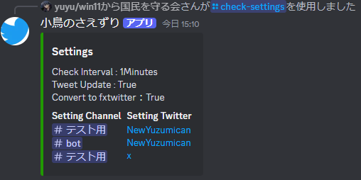

# RSS-Free Tweet Acquisition Discord Bot

English [中文](./README_zh.md) [日本語](README_ja.md) 

Until now, there was only a method to acquire tweets using RSS, but we have overcome this by using a Twitter account.
## Table of Contents
- [Features](#features)
- [In Progress](#in-progress)
- [Installation](#installation)
- [Configuration](#configuration)
- [Commands](#commands)

## Features

- Automatic tweet acquisition without cost
- Support for multiple servers and channels
- Automatic conversion to fxtwitter and fxtiktok

## In Progress

 - [ ] Support for AliExpress
 - [ ] Fork fxtwitter and customize it independently

## Installation

Here are the installation steps for the project.
Linux or Mac
```bash
 python3 -m pip install -r requirements.txt
```
Windows
```bash
 pip install -r requirements.txt
```
### Configuration
1. Please install this [extension](https://chromewebstore.google.com/detail/cookie-editor/hlkenndednhfkekhgcdicdfddnkalmdm).
2. Copy the cookie as shown in the image below.

3. Save the copied cookie as cookie.json in the crc/twitter_json directory.

[sample.env](./src/sample.env)

Please configure the following two items:
```dotenv
TOKEN="Discord_token"
#support ja_JP en_US zh_CN
Languages="en_US"
```
rename
sample.env -> .env
How to Start
Linux or Mac
```bash
cd src 
python3 Bot.py
```
Windows
```bash
cd src
py Bot.py
```
Setting Up Discord
Please invite with the following settings:


## Commands & Capabilities
- Add automatic posts from the user with the channel's name

```
/set_twitter twitter_user_name:
```


- Remove automatic posts from the user with the channel's name
```
/del_twitter twitter_user_name:
```


- Automatic posting


- Display current settings
```
/check-settings 
```


- Toggle fxtwitter conversion feature On/Off
```
/change-setting-twitter-get mode:
```

