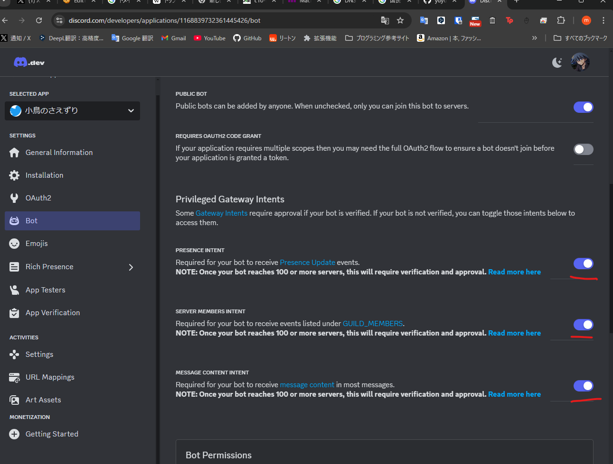
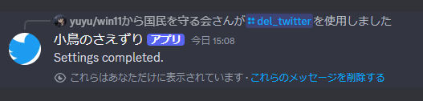

# RSS-free tweet acquisition discord bot

[英語](./README.md) [中文](./README_zh.md) 日本語

これまでRSSを使ったツイートを取得する方法しかありませんでしたが
Twitterのアカウントを使うことによりそれを克服しました
## 目次
- [特徴](#特徴)
- [進行中](#現在進行中)
- [インストール](#インストール方法)
- [設定](#設定)
- [コマンド](#コマンドできること)
## 特徴

- お金がかからないツイートの自動取得
- 複数のサーバー、チャンネルに対応
-  自動fxtwitter,fxtiktokに変換

## 現在進行中

 - [ ] アリエクに対応
 - [ ] fxtwitterをフォークし独自に改造

## インストール方法

プロジェクトのインストール手順を記載します。
Linux or Mac
```bash
 start.sh
```
Windows
```bash
 start.bat
```
### 設定
1. この[拡張機能](https://chromewebstore.google.com/detail/cookie-editor/hlkenndednhfkekhgcdicdfddnkalmdm)をインストールしてください
2. 以下の画像のようにしてcookieをコピーしてください

3. コピーしたcookieを crc/twitter_json内にcookie.jsonと言う名前にして保存してください

[sample.env](./src/sample.env)

以下の2つを設定してください
```dotenv
TOKEN="Discord_token"
#support ja_JP en_US zh_CN
Languages="en_US"
```
名前の変更
sample.env -> .env
開始方法
Linux or Mac
```bash
cd src 
python3 Bot.py
```
Windows
```bash
cd src
py Bot.py
```
Discordのセットアップ
以下の設定で招待をしてください


## コマンド&できること
```
/set_twitter twitter_user_name:
```
- そのチャンネルの名前の人の自動投稿を追加


- そのチャンネルの名前の人の自動投稿を削除
```
/del_twitter twitter_user_name:
```


- 自動投稿


- 現在の設定の表示
```
/check-settings 
```


- fxtwitterに変換機能の On OFF
```
/change-setting-twitter-get mode:
```

