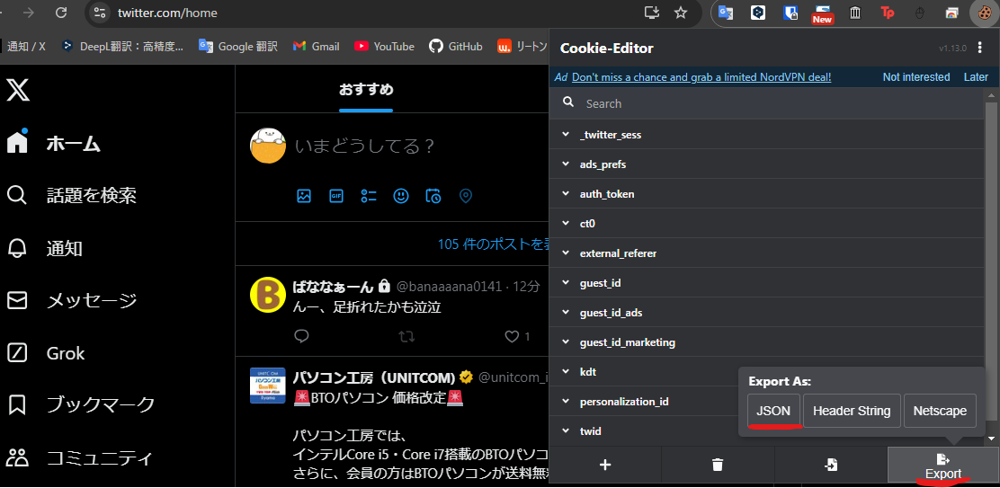
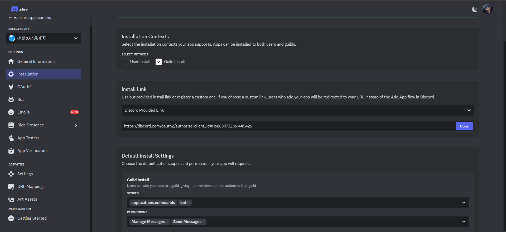
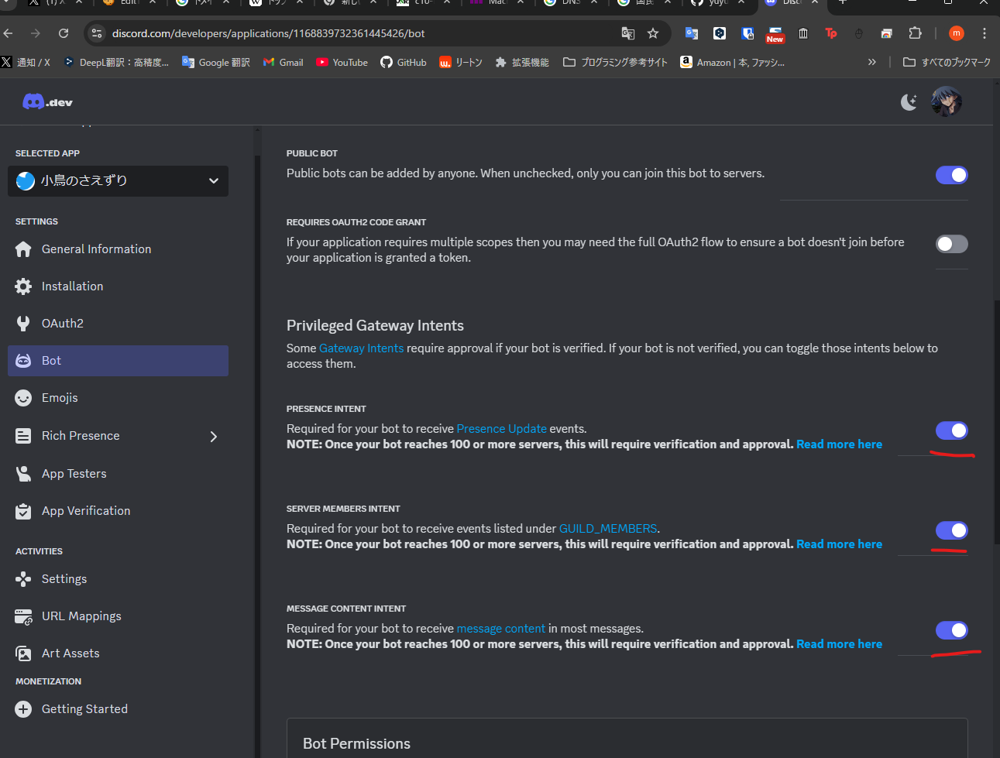
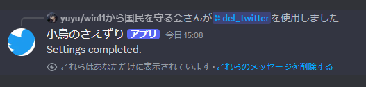
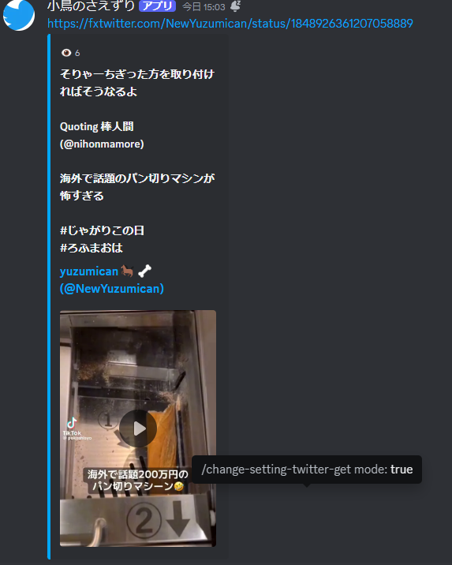
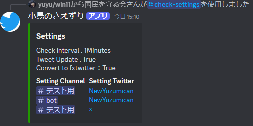
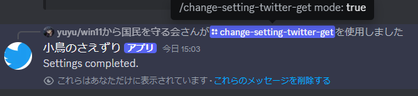

# 无需RSS的推文获取Discord机器人

[English](README.md) 中文 [日本語](README_ja.md)

以前只能通过RSS获取推文，
现在通过使用Twitter账户克服了这个限制
## 目录
- [特点](#特点)
- [进行中](#当前进行中)
- [安装](#安装方法)
- [设置](#设置)
- [命令](#命令功能)

## 特点

- 免费自动获取推文
- 支持多个服务器和频道
- 自动转换为fxtwitter和fxtiktok格式

## 当前进行中

 - [ ] 支持速卖通
 - [ ] 分叉fxtwitter并进行自定义修改

## 安装方法

以下是项目的安装步骤。
Linux或Mac
```bash
 start.sh
```
Windows
```bash
 start.bat
```
### 设置
1. 请安装这个[扩展程序](https://chromewebstore.google.com/detail/cookie-editor/hlkenndednhfkekhgcdicdfddnkalmdm)
2. 如下图所示复制cookie

3. 将复制的cookie保存为crc/twitter_json目录下的cookie.json文件

[sample.env](./src/sample.env)

请设置以下两项
```dotenv
TOKEN="Discord_token"
#支持 ja_JP en_US zh_CN
Languages="en_US"
```
重命名
sample.env -> .env
启动方法
Linux或Mac
```bash
cd src 
python3 Bot.py
```
Windows
```bash
cd src
py Bot.py
```
Discord设置
请使用以下设置进行邀请


## 命令&功能
```
/set_twitter twitter_user_name:
```
- 添加该频道用户名的自动发布


- 删除该频道用户名的自动发布
```
/del_twitter twitter_user_name:
```


- 自动发布



- 显示当前设置
```
/check-settings 
```


- 开启/关闭fxtwitter转换功能
```
/change-setting-twitter-get mode:
```

