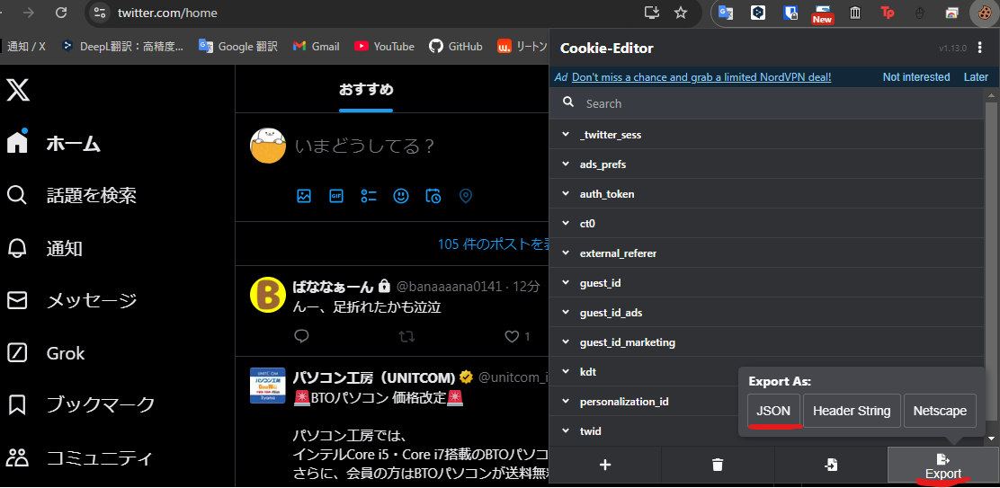
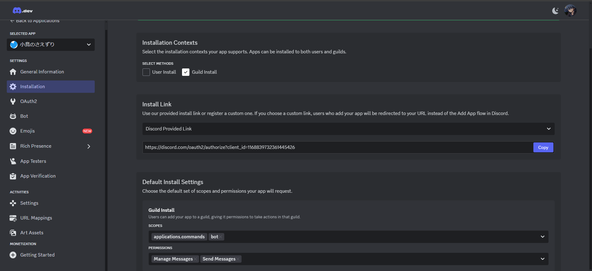
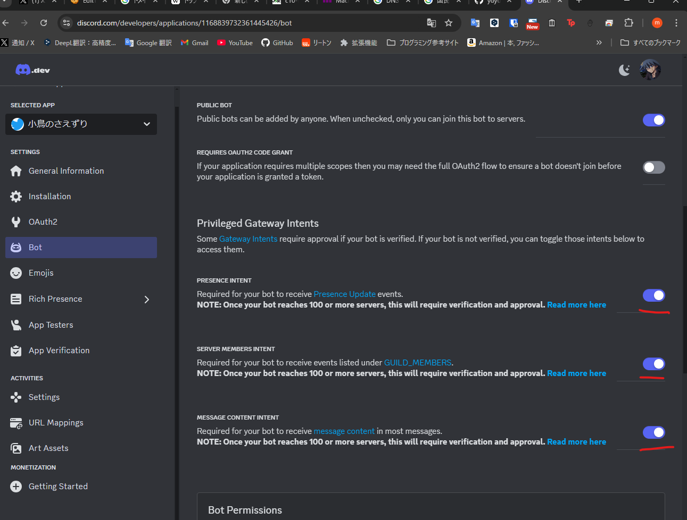
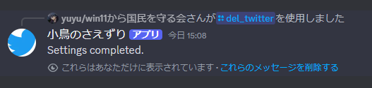
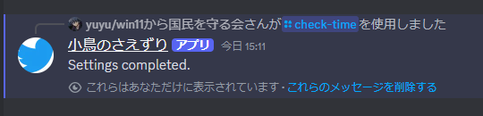
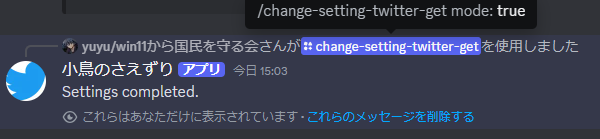
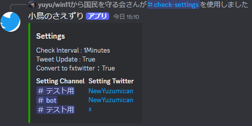
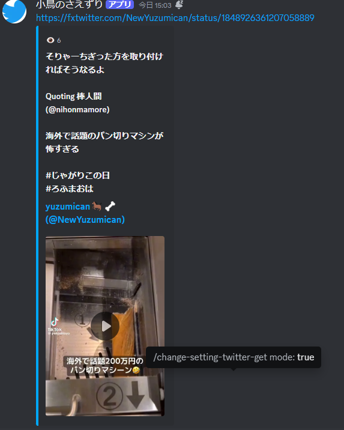

# 无需RSS的推文获取Discord机器人

[English](README.md) 中文 [日本語](README_ja.md)

以前只能通过RSS获取推文，现在通过使用Twitter账户克服了这个限制。

## 目录
- [特点](#特点)
- [进行中](#当前进行中)
- [安装](#安装方法)
- [设置](#设置)
- [命令](#命令功能)

## 特点

- 免费自动获取推文
- 支持多个服务器和频道
- 自动转换为fxtwitter和fxtiktok URL
- 基于数据库的配置存储
- 多语言支持（英语、日语、中文）

## 当前进行中

 - [ ] 支持速卖通
 - [ ] 分叉fxtwitter并进行自定义修改

## 安装方法

以下是项目的安装步骤。

### 前提条件
- Python 3.8或更高版本
- Discord机器人令牌

### 安装依赖
Linux或Mac
```bash
python3 -m pip install -r requirements.txt
```
Windows
```bash
pip install -r requirements.txt
```

## 设置

### 1. Twitter Cookie设置
1. 请安装这个[Chrome扩展程序](https://chromewebstore.google.com/detail/cookie-editor/hlkenndednhfkekhgcdicdfddnkalmdm)。
2. 如下图所示复制cookie。

3. 将复制的cookie保存为`data/`目录下的`cookie.json`文件。

### 2. 环境变量
在项目根目录创建`.env`文件，并进行以下配置：
```dotenv
TOKEN="你的Discord机器人令牌"
# 支持的语言: ja_JP, en_US, zh_CN
Languages="zh_CN"
```

### 3. Discord机器人设置
请使用以下权限邀请你的机器人：



### 4. 启动方法
Linux或Mac
```bash
python3 main.py
```
Windows
```bash
python main.py
```

## 命令&功能

### Twitter订阅管理
- **向频道添加Twitter订阅**
```
/set_twitter twitter_user_name: <用户名>
```


- **从频道删除Twitter订阅**
```
/del_twitter user_name: <用户名>
```


### 设置管理
- **设置Twitter更新冷却时间**
```
/check-time minutes: <分钟数>
```


- **开启/关闭Twitter更新**
```
/change-setting-twitter-get mode: <true/false>
```

- **开启/关闭URL预览转换**
```
/change-setting-url-preview mode: <true/false>
```


- **显示当前设置**
```
/check-settings
```


### 自动功能
- **自动Twitter发布**


- **自动URL转换** - 将Twitter/X和TikTok URL转换为fxtwitter/fxtiktok以获得更好的嵌入显示

## 项目结构
```
twikit_discord_bot/
├── data/                     # 应用程序数据文件
│   ├── cookie.json          # Twitter认证cookie
│   ├── cookie_edit.json     # 备份cookie文件
│   ├── DiscordSetting.json  # Discord服务器设置
│   └── Twitter_msg.json     # Twitter消息缓存
├── src/
│   ├── cogs/                # Discord命令模块
│   │   ├── twitter_commands.py  # Twitter相关斜杠命令
│   │   └── url_fixer.py         # URL替换功能
│   ├── core/                # 核心机器人功能
│   │   ├── bot.py           # 主机器人类和事件处理器
│   │   ├── database.py      # 数据库操作
│   │   └── twitter_client.py    # Twitter API客户端
│   ├── config/              # 配置管理
│   │   └── settings.py      # 设置和文件I/O操作
│   └── lang/                # 语言文件
│       ├── en_US.json       # 英语翻译
│       ├── ja_JP.json       # 日语翻译
│       └── zh_CN.json       # 中文翻译
├── main.py                  # 应用程序入口点
├── requirements.txt         # Python依赖
└── .env                     # 环境变量
```
