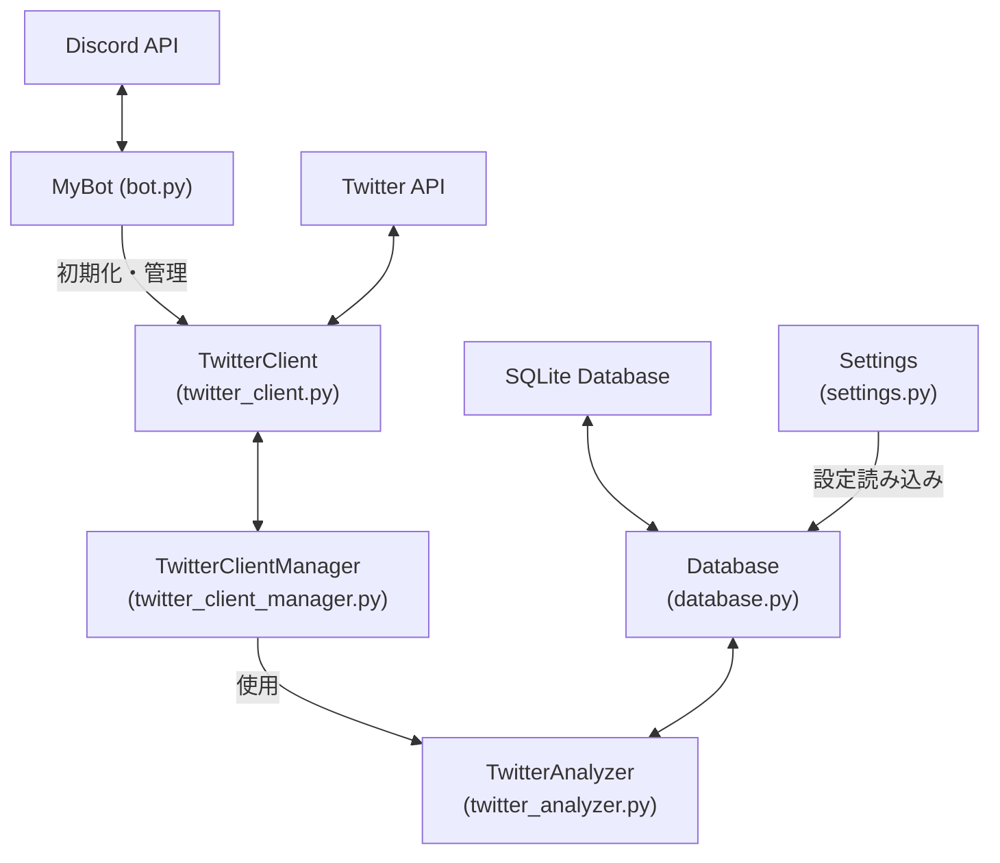
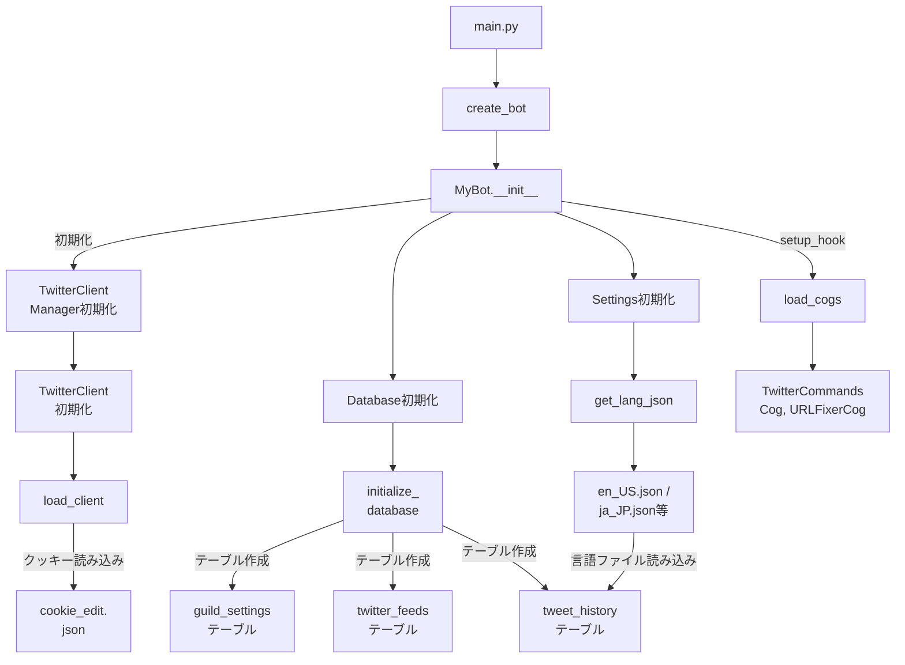
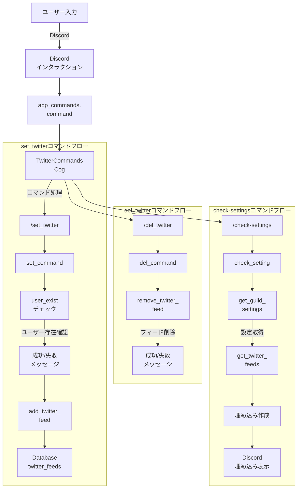
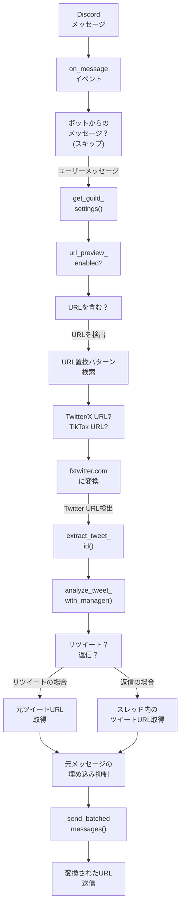

# Twikit Discord Bot 詳細説明書

## 目次

1. [はじめに](#はじめに)
2. [アーキテクチャ概要](#アーキテクチャ概要)
   - [コアコンポーネント](#コアコンポーネント)
   - [コンポーネント間の関係](#コンポーネント間の関係)
3. [初期化と起動プロセス](#初期化と起動プロセス)
   - [ボットの初期化](#ボットの初期化)
   - [設定の読み込み](#設定の読み込み)
   - [データベースの初期化](#データベースの初期化)
   - [Twitterクライアントの初期化](#twitterクライアントの初期化)
   - [コグの読み込み](#コグの読み込み)
4. [Twitterフィード管理コマンド](#twitterフィード管理コマンド)
   - [/set_twitter](#set_twitter)
   - [/del_twitter](#del_twitter)
   - [/check-settings](#check-settings)
   - [/check-time](#check-time)
   - [/change-setting-twitter-get](#change-setting-twitter-get)
   - [/change-setting-url-preview](#change-setting-url-preview)
   - [/set-tweet-filter](#set-tweet-filter)
   - [/test-tweet](#test-tweet)
5. [ツイート取得と分析プロセス](#ツイート取得と分析プロセス)
   - [定期的なツイートチェック](#定期的なツイートチェック)
   - [ツイート分析](#ツイート分析)
   - [ツイートの投稿](#ツイートの投稿)
6. [URL強化機能](#url強化機能)
   - [URLの検出と変換](#urlの検出と変換)
   - [リツイートと返信の展開](#リツイートと返信の展開)
7. [データベース管理](#データベース管理)
   - [ギルド設定](#ギルド設定)
   - [Twitterフィード](#twitterフィード)
   - [ツイート履歴](#ツイート履歴)
8. [よくあるユースケース](#よくあるユースケース)
   - [新しいTwitterフィードの設定](#新しいtwitterフィードの設定)
   - [設定の確認と変更](#設定の確認と変更)
   - [TwitterリンクのDiscordでの表示改善](#twitterリンクのdiscordでの表示改善)

## はじめに

Twikit Discord Botは、RSSフィードを使用せずに自動的にツイートを取得するDiscordボットです。Twitterアカウントを使用してツイートを取得し、複数のサーバーとチャンネルをサポートします。このボットは、Discordサーバー管理者が特定のTwitterユーザーからの自動ツイートフィードを設定するためのシームレスな方法を提供します。

このドキュメントでは、ボットの動作、アーキテクチャ、および使用方法について詳細に説明します。

## アーキテクチャ概要

Twikit Discord Botは、モジュール式のアーキテクチャを採用しており、関心事の明確な分離を実現しています。

### コアコンポーネント

### アーキテクチャ図



ボットは以下の主要コンポーネントで構成されています：

1. **ボットコア** (`src/core/bot.py`)
   - Discord.pyのcommands.Botクラスを拡張したMyBotクラスを含みます
   - ボットの初期化、設定の読み込み、データベース接続の確立を担当します
   - コグの読み込みとイベントハンドラの設定を行います

2. **Twitterクライアント** (`src/core/twitter_client.py`)
   - TwitterClientクラスはTwitter APIとの通信を処理します
   - ツイートの取得、ユーザー情報の取得、リツイートの確認などの機能を提供します

3. **Twitterクライアントマネージャー** (`src/core/twitter_client_manager.py`)
   - TwitterClientManagerクラスはゲストクライアントと認証済みクライアントの両方を管理します
   - レート制限の処理とクライアント間のフォールバックメカニズムを提供します

4. **Twitter分析器** (`src/core/twitter_analyzer.py`)
   - ツイートの分析と会話スレッドの取得を実装します
   - ツイートのタイプ（通常、リツイート、返信）を判断します

5. **データベース** (`src/core/database.py`)
   - Databaseクラスはデータベース操作を処理します
   - ギルド設定、Twitterフィード、ツイート履歴の保存と取得を担当します

6. **設定** (`src/config/settings.py`)
   - Settingsクラスは設定と言語ファイルの管理を担当します
   - 多言語サポートを提供します（英語、日本語、中国語）

7. **Discordコマンド**
   - **Twitterコマンド** (`src/cogs/twitter_commands.py`): Twitterフィード管理のためのスラッシュコマンドを実装します
   - **URL修正器** (`src/cogs/url_fixer.py`): 自動URL変換を処理します

### コンポーネント間の関係

コンポーネント間の関係は以下の通りです：

- **MyBot**はSettingsとDatabaseのインスタンスを作成し、TwitterClientとTwitterClientManagerを初期化します
- **TwitterClientManager**はTwitterClientを使用してTwitter APIと通信します
- **TwitterCommandsCog**はMyBotのインスタンスを参照し、データベースとTwitterクライアントにアクセスします
- **URLFixerCog**もMyBotのインスタンスを参照し、TwitterClientManagerを使用してツイートを分析します

## 初期化と起動プロセス

### 初期化フロー図



### ボットの初期化

ボットの初期化プロセスは以下の手順で行われます：

1. `main.py`が`run_bot`関数を呼び出します
2. `run_bot`関数は`create_bot`関数を使用して新しいMyBotインスタンスを作成します
3. MyBotのコンストラクタは以下を実行します：
   - Discordのインテントを設定します
   - 環境変数からトークンとアプリケーションIDを読み込みます
   - 親クラスのコンストラクタを呼び出します
   - Settings、Database、TwitterClient、TwitterClientManagerのインスタンスを初期化します

### 設定の読み込み

設定の読み込みプロセスは以下の通りです：

1. Settingsクラスのコンストラクタは以下を実行します：
   - プロジェクトルート、データディレクトリ、言語ファイルディレクトリのパスを設定します
   - 指定された言語ファイルから言語データを読み込みます

### データベースの初期化

データベースの初期化プロセスは以下の通りです：

1. Databaseクラスのコンストラクタは以下を実行します：
   - データベースファイルへのパスを設定します
   - SQLite接続を確立します
   - カーソルをrow factoryとして設定し、結果を辞書として取得できるようにします
2. `initialize_database`メソッドは必要なテーブルを作成します：
   - `guild_settings`: ギルドごとの設定を保存します
   - `twitter_feeds`: Twitterフィードの情報を保存します
   - `tweet_history`: ツイート履歴を保存します
   - `migration`: データ移行の状態を追跡します

### Twitterクライアントの初期化

Twitterクライアントの初期化プロセスは以下の通りです：

1. TwitterClientクラスのコンストラクタは以下を実行します：
   - twikitクライアントを初期化します
   - クッキーファイルへのパスを設定します
2. `load_client`メソッドはクッキーファイルからクッキーを読み込みます
3. TwitterClientManagerクラスのコンストラクタは以下を実行します：
   - ゲストクライアントと認証済みクライアントを初期化します
   - クライアントの状態とレート制限を追跡するための変数を設定します
4. `initialize`メソッドは両方のクライアントをアクティブ化します

### コグの読み込み

コグの読み込みプロセスは以下の通りです：

1. `setup_hook`メソッドは`load_cogs`メソッドを呼び出します
2. `load_cogs`メソッドは以下を実行します：
   - `src/cogs`ディレクトリ内のすべてのPythonファイルを検索します
   - 各ファイルを動的にインポートします
   - commands.Cogのサブクラスを見つけてボットに追加します

## Twitterフィード管理コマンド

### コマンドフロー図



Twikit Discord Botは、Twitterフィードを管理するための以下のスラッシュコマンドを提供します：

### /set_twitter

このコマンドは現在のチャンネルにTwitterフィードを設定します。

**使用方法**: `/set_twitter twitter_user_name:ユーザー名`

**必要な権限**: `manage_channels`（チャンネル管理）

**処理フロー**:
1. チャンネルIDとギルドIDを取得します
2. データベースからギルド設定を取得します
3. 設定が存在しない場合、デフォルト設定を作成します
4. Twitter更新が有効になっているか確認します
5. 指定されたTwitterユーザーが存在するか確認します
6. Twitterフィードをデータベースに追加します
7. 成功または失敗のメッセージを表示します

### /del_twitter

このコマンドはチャンネルからTwitterフィードを削除します。

**使用方法**: `/del_twitter user_name:ユーザー名`

**必要な権限**: `manage_channels`（チャンネル管理）

**処理フロー**:
1. チャンネルIDを取得します
2. データベースからTwitterフィードを削除します
3. 成功または失敗のメッセージを表示します

### /check-settings

このコマンドはギルドの現在の設定と設定済みのTwitterフィードを表示します。

**使用方法**: `/check-settings`

**必要な権限**: なし

**処理フロー**:
1. ギルドIDを取得します
2. データベースからギルド設定を取得します
3. 設定が存在しない場合、デフォルト設定を作成します
4. このギルドに設定されているすべてのTwitterフィードを取得します
5. 設定情報を含むDiscord埋め込みを作成します
6. 埋め込みをチャンネルに送信します

### /check-time

このコマンドは現在のギルドのTwitter更新のクールダウン時間（分）を設定します。

**使用方法**: `/check-time minutes:分数`

**必要な権限**: `manage_channels`（チャンネル管理）

**処理フロー**:
1. 分数が1以上であることを確認します
2. データベースでギルドのクールダウン設定を更新します
3. 新しいクールダウン設定に基づいてチェック間隔を更新します
4. 成功メッセージを表示します

### /change-setting-twitter-get

このコマンドは現在のギルドのTwitter更新を有効または無効にします。

**使用方法**: `/change-setting-twitter-get mode:True/False`

**必要な権限**: `manage_channels`（チャンネル管理）

**処理フロー**:
1. ギルドIDを取得します
2. データベースでtwitter_updates_enabled設定を更新します
3. チェック間隔を更新します
4. 成功メッセージを表示します

### /change-setting-url-preview

このコマンドは現在のギルドのURLプレビュー（fxtwitter.com変換）を有効または無効にします。

**使用方法**: `/change-setting-url-preview mode:True/False`

**必要な権限**: `manage_channels`（チャンネル管理）

**処理フロー**:
1. ギルドIDを取得します
2. データベースでurl_preview_enabled設定を更新します
3. 成功メッセージを表示します

### /set-tweet-filter

このコマンドは現在のギルドに投稿するツイートのタイプを設定します。

**使用方法**: `/set-tweet-filter filter_type:フィルタータイプ`

**必要な権限**: `manage_channels`（チャンネル管理）

**有効なフィルタータイプ**:
- `original`: オリジナルツイートのみ
- `retweet`: リツイートのみ
- `reply`: 返信のみ
- `original,retweet`: オリジナルツイートとリツイート
- `original,reply`: オリジナルツイートと返信
- `retweet,reply`: リツイートと返信
- `all`: すべてのタイプ

**処理フロー**:
1. ギルドIDを取得します
2. フィルタータイプを検証します
3. データベースでtweet_type_filter設定を更新します
4. 成功メッセージを表示します

### /test-tweet

このコマンドはツイートURLを分析し、埋め込みとして表示します。

**使用方法**: `/test-tweet url:ツイートURL`

**必要な権限**: `manage_channels`（チャンネル管理）

**処理フロー**:
1. URLからツイートIDを抽出します
2. ツイートを分析します
3. ツイートの埋め込みを作成して表示します

## ツイート取得と分析プロセス

### ツイート取得フロー図

```mermaid
flowchart TD
    TasksLoop["@tasks.loop\n(seconds=10)"] --> Loop["loop()\n10秒ごと実行"]
    Loop --> GetAllGuildIds["get_all_guild_\nids()"]
    
    GetAllGuildIds -- "各ギルドに対して" --> GuildId["ギルドID"]
    GuildId --> GetGuildSettings["get_guild_\nsettings()"]
    GetGuildSettings --> CooldownCheck["クールダウン\nチェック"]
    
    CooldownCheck -- "クールダウン経過" --> UpdateGuildSettings["update_guild_\nsettings()"]
    UpdateGuildSettings --> GetTwitterFeeds["get_twitter_\nfeeds()"]
    GetTwitterFeeds --> ProcessTwitterFeed["_process_\ntwitter_feed()"]
    
    ProcessTwitterFeed -- "各フィードに対して" --> GetTweetHistory["get_tweet_\nhistory()"]
    GetTweetHistory --> GetTwitterUserLastUpdated["get_twitter_\nuser_last_\nupdated()"]
    GetTwitterUserLastUpdated --> RecentlyUpdatedCheck["最近更新済み？\nキャッシュ使用"]
    
    RecentlyUpdatedCheck -- "更新必要" --> GetLatestTweets["get_latest_\ntweets_with_\nmanager()"]
    GetLatestTweets --> UpdateTwitterUserLastUpdated["update_twitter_\nuser_last_\nupdated()"]
    UpdateTwitterUserLastUpdated --> FilterNewTweets["新しいツイート\nフィルタリング"]
    
    FilterNewTweets -- "ツイートタイプフィルター" --> AnalyzeTweet["analyze_tweet_\nwith_manager()"]
    AnalyzeTweet --> SendTweetEmbed["_send_tweet_\nembed()"]
    SendTweetEmbed --> UpdateTweetHistory["update_tweet_\nhistory()"]
```



### 定期的なツイートチェック

ボットは定期的にTwitterフィードをチェックし、新しいツイートを取得して投稿します。このプロセスは以下の通りです：

1. `loop`メソッドは10秒ごとに実行されます
2. すべてのギルドIDを取得します
3. 各ギルドに対して：
   - ギルド設定を取得します
   - Twitter更新が無効になっている場合はスキップします
   - クールダウン時間をチェックし、まだクールダウン中の場合はスキップします
   - ギルドの最終チェック時間を更新します
   - このギルドのすべてのTwitterフィードを取得して処理します

### ツイート分析

ツイート分析プロセスは以下の通りです：

1. `analyze_tweet`関数はツイートを分析し、そのタイプ（通常、リツイート、返信）を判断します
2. ツイートがリツイートの場合、元のツイートの情報を取得します
3. ツイートが返信の場合、会話スレッド全体を取得します
4. 分析結果を辞書として返します

### ツイートの投稿

ツイートの投稿プロセスは以下の通りです：

1. `_process_twitter_feed`メソッドは以下を実行します：
   - チャンネルIDとTwitterユーザー名を取得します
   - このフィードのツイート履歴を取得します
   - このTwitterユーザーが最近更新されたかチェックします
   - 最近更新された場合、キャッシュされたデータを使用します
   - そうでない場合、ユーザーの最新ツイートを取得します
   - このTwitterユーザーの最終更新タイムスタンプを更新します
   - 最後に見たツイートよりも新しいツイートをフィルタリングします
   - ツイートタイプフィルターに基づいてツイートをフィルタリングします
   - 各新しいツイートに対して埋め込みを作成して送信します
   - 最新のツイートIDとURLでデータベースを更新します

2. `_send_tweet_embed`メソッドは以下を実行します：
   - ツイートの埋め込みを作成します
   - 作者情報を追加します
   - タイムスタンプを追加します
   - ツイートタイプに基づいてフッターを追加します
   - より良い埋め込みのためにfxtwitter.comのURLを追加します
   - 埋め込みをチャンネルに送信します

## URL強化機能

### URL強化フロー図



### URLの検出と変換

URL強化機能は以下のように動作します：

1. `on_message`イベントリスナーはDiscordチャンネルで送信されるすべてのメッセージをリッスンします
2. ボットからのメッセージは無視されます
3. ギルド設定を取得し、URLプレビューが無効になっている場合は処理をスキップします
4. メッセージ内のすべてのURLを検出します
5. 以下のURLパターンを置換します：
   - `https://x.com` → `https://fxtwitter.com`
   - `https://twitter.com` → `https://fxtwitter.com`
   - `https://www.tiktok.com` → `https://fxtiktok.com`
   - `https://tiktok.com` → `https://fxtiktok.com`
6. 元のメッセージの埋め込みを抑制します
7. 置換されたURLをバッチで送信します

### リツイートと返信の展開

TwitterのURLに対して、ボットは追加の分析を行います：

1. ツイートIDを抽出し、ツイートを分析します
2. ツイートがリツイートの場合：
   - 元のツイートのURLを取得します
   - 追加のURLリストに追加します
3. ツイートが返信の場合：
   - スレッド内の各ツイートのURLを取得します
   - 追加のURLリストに追加します
4. すべてのURLをフォーマットし、バッチで送信します

## データベース管理

### ギルド設定

ギルド設定は`guild_settings`テーブルに保存され、以下のフィールドを含みます：

- `guild_id`: DiscordギルドのID
- `twitter_updates_enabled`: Twitter更新が有効かどうか（ブール値）
- `url_preview_enabled`: URLプレビューが有効かどうか（ブール値）
- `cool_down_minutes`: 更新間のクールダウン時間（分）
- `last_checked_time`: 最後にチェックされた時間（Unixタイムスタンプ）
- `tweet_type_filter`: 投稿するツイートのタイプ（文字列）

### Twitterフィード

Twitterフィードは`twitter_feeds`テーブルに保存され、以下のフィールドを含みます：

- `id`: フィードの一意のID
- `guild_id`: DiscordギルドのID
- `channel_id`: DiscordチャンネルのID
- `twitter_user_name`: Twitterユーザーのスクリーンネーム
- `last_updated`: 最後に更新された時間（Unixタイムスタンプ）

### ツイート履歴

ツイート履歴は`tweet_history`テーブルに保存され、以下のフィールドを含みます：

- `id`: 履歴エントリの一意のID
- `feed_id`: 関連するTwitterフィードのID
- `last_tweet_id`: 最新のツイートのID
- `second_last_tweet_id`: 2番目に新しいツイートのID
- `last_tweet_url`: 最新のツイートのURL
- `second_last_tweet_url`: 2番目に新しいツイートのURL

## よくあるユースケース

### 新しいTwitterフィードの設定

1. `/set_twitter`コマンドを使用して、現在のチャンネルに新しいTwitterフィードを設定します：
   ```
   /set_twitter twitter_user_name:elonmusk
   ```
2. ボットは指定されたTwitterユーザーが存在するか確認します
3. ユーザーが存在する場合、ボットはフィードをデータベースに追加し、成功メッセージを表示します
4. これで、ボットは定期的にこのTwitterユーザーの新しいツイートをチェックし、チャンネルに投稿します

### 設定の確認と変更

1. `/check-settings`コマンドを使用して、現在のギルドの設定を確認します：
   ```
   /check-settings
   ```
2. ボットは現在の設定と設定済みのTwitterフィードを表示します
3. 設定を変更するには、以下のコマンドを使用します：
   - クールダウン時間を変更する：`/check-time minutes:5`
   - Twitter更新を有効/無効にする：`/change-setting-twitter-get mode:True`
   - URLプレビューを有効/無効にする：`/change-setting-url-preview mode:True`
   - ツイートフィルターを設定する：`/set-tweet-filter filter_type:all`

### TwitterリンクのDiscordでの表示改善

1. Discordチャンネルに通常のTwitter/XのURLを投稿します：
   ```
   https://twitter.com/elonmusk/status/1234567890
   ```
2. ボットはURLを検出し、fxtwitter.comのURLに変換します：
   ```
   https://fxtwitter.com/elonmusk/status/1234567890
   ```
3. ボットは元のメッセージの埋め込みを抑制し、変換されたURLを新しいメッセージとして送信します
4. ツイートがリツイートまたは返信の場合、ボットは関連するツイートのURLも送信します
5. これにより、Discordでのツイートの表示が改善され、画像やビデオが適切に埋め込まれます